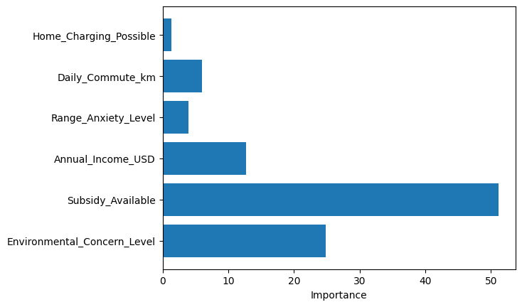

# Predictive Analysis: Electric Vehicle Interest

*Load data*


```python
import pandas as pd
import numpy as np

test_df = pd.read_csv("./test.csv")
train_df = pd.read_csv("./train.csv")
```

*Preview the first few rows*


```python
train_df.head()
```


<div>
<style scoped>
    .dataframe tbody tr th:only-of-type {
        vertical-align: middle;
    }

    .dataframe tbody tr th {
        vertical-align: top;
    }

    .dataframe thead th {
        text-align: right;
    }
</style>
<table border="1" class="dataframe">
  <thead>
    <tr style="text-align: right;">
      <th></th>
      <th>id</th>
      <th>Age</th>
      <th>Annual_Income_USD</th>
      <th>Daily_Commute_km</th>
      <th>Number_of_Cars_Owned</th>
      <th>Charging_Stations_Near_Home</th>
      <th>Charging_Stations_Near_Work</th>
      <th>Environmental_Concern_Level</th>
      <th>Gender</th>
      <th>City_Type</th>
      <th>Current_Car_Type</th>
      <th>Home_Charging_Possible</th>
      <th>Subsidy_Available</th>
      <th>Range_Anxiety_Level</th>
      <th>Will_Buy_EV</th>
    </tr>
  </thead>
  <tbody>
    <tr>
      <th>0</th>
      <td>0</td>
      <td>66</td>
      <td>92887.0</td>
      <td>23.4</td>
      <td>2</td>
      <td>3</td>
      <td>7</td>
      <td>1.0</td>
      <td>Male</td>
      <td>Suburban</td>
      <td>Sedan</td>
      <td>Yes</td>
      <td>No</td>
      <td>Low</td>
      <td>No</td>
    </tr>
    <tr>
      <th>1</th>
      <td>1</td>
      <td>38</td>
      <td>30000.0</td>
      <td>5.0</td>
      <td>1</td>
      <td>2</td>
      <td>2</td>
      <td>4.0</td>
      <td>Male</td>
      <td>Rural</td>
      <td>SUV</td>
      <td>Yes</td>
      <td>No</td>
      <td>Low</td>
      <td>No</td>
    </tr>
    <tr>
      <th>2</th>
      <td>2</td>
      <td>26</td>
      <td>94389.0</td>
      <td>36.8</td>
      <td>1</td>
      <td>8</td>
      <td>15</td>
      <td>5.0</td>
      <td>Female</td>
      <td>Urban</td>
      <td>Sedan</td>
      <td>No</td>
      <td>Yes</td>
      <td>Low</td>
      <td>Yes</td>
    </tr>
    <tr>
      <th>3</th>
      <td>3</td>
      <td>66</td>
      <td>73580.0</td>
      <td>23.7</td>
      <td>2</td>
      <td>6</td>
      <td>9</td>
      <td>3.0</td>
      <td>Male</td>
      <td>Suburban</td>
      <td>Hatchback</td>
      <td>Yes</td>
      <td>No</td>
      <td>Low</td>
      <td>No</td>
    </tr>
    <tr>
      <th>4</th>
      <td>4</td>
      <td>54</td>
      <td>57898.0</td>
      <td>50.8</td>
      <td>1</td>
      <td>2</td>
      <td>3</td>
      <td>3.0</td>
      <td>Male</td>
      <td>Suburban</td>
      <td>Hatchback</td>
      <td>Yes</td>
      <td>No</td>
      <td>Low</td>
      <td>No</td>
    </tr>
  </tbody>
</table>
</div>


*Information on data types*


```python
train_df.info()
```

    <class 'pandas.DataFrame'>
    RangeIndex: 668665 entries, 0 to 668664
    Data columns (total 15 columns):
     #   Column                       Non-Null Count   Dtype  
    ---  ------                       --------------   -----  
     0   id                           668665 non-null  int64  
     1   Age                          668665 non-null  int64  
     2   Annual_Income_USD            668665 non-null  float64
     3   Daily_Commute_km             668665 non-null  float64
     4   Number_of_Cars_Owned         668665 non-null  int64  
     5   Charging_Stations_Near_Home  668665 non-null  int64  
     6   Charging_Stations_Near_Work  668665 non-null  int64  
     7   Environmental_Concern_Level  668665 non-null  float64
     8   Gender                       668665 non-null  str    
     9   City_Type                    668665 non-null  str    
     10  Current_Car_Type             668665 non-null  str    
     11  Home_Charging_Possible       668665 non-null  str    
     12  Subsidy_Available            668665 non-null  str    
     13  Range_Anxiety_Level          668665 non-null  str    
     14  Will_Buy_EV                  668665 non-null  str    
    dtypes: float64(3), int64(5), str(7)
    memory usage: 93.5 MB
    

*Let's examine the distribution of our target variable `Will_Buy_EV`.*


```python
target_counts = train_df["Will_Buy_EV"].value_counts()
target_distribution = train_df["Will_Buy_EV"].value_counts(normalize=True)
print(f"target_counts :\n{target_counts}\n")
print(f"\ntarget_distribution :\n{target_distribution}")
```

    target_counts :
    Will_Buy_EV
    No     551886
    Yes    116779
    Name: count, dtype: int64
    
    
    target_distribution :
    Will_Buy_EV
    No     0.825355
    Yes    0.174645
    Name: proportion, dtype: float64
    

### Finding the best features for our model
We use concepts from Information Theory (entropy, conditional entropy, information gain) to identify which features are most predictive.

#### **Entropy**:
$$H(X) = -\sum_{x \in X} p(x) \log_2 p(x)$$

#### **Joint Entropy**:
$$H(X, Y) = -\sum_{x \in X} \sum_{y \in Y} p(x, y) \log_2 p(x, y)$$

#### **Conditional Entropy**:
$$H(X|Y) = H(X,Y) - H(Y)$$

#### **Information Gain**:
$$I(X, Y) = H(X) - H(X | Y)$$

---
Function Implementation 


```python
def entropy(X):
    X = X/np.sum(X)
    # Add 1e-12 (epsilon) for numerical stability (avoid log(0))
    return -(np.sum(X*np.log2(X + 1e-12)))

def joint_entropy(X,Y):
    joint_counts = pd.crosstab(X, Y)
    return entropy(joint_counts.values.flatten())

def conditional_entropy(X,Y):
    joint = joint_entropy(X,Y)
    return joint - entropy(Y.value_counts().values)

def information_gain(df, target_col, feature_col):
    h_target = entropy(df[target_col].value_counts().values)
    h_cond = conditional_entropy(df[target_col], df[feature_col])
    return h_target - h_cond

```

---
Calculate Information Gain for all features


```python
features = train_df.columns.drop(["Will_Buy_EV", "id"])
results = {
    col: round(information_gain(train_df, "Will_Buy_EV", col), 3)
    for col in features
}
sorted_i = pd.Series(results).sort_values(ascending=False)
features_to_keep = sorted_i[sorted_i > 0.003].index.tolist()
print("Feature Ranking by Information Gain:")
print(sorted_i)
```

    Feature Ranking by Information Gain:
    Environmental_Concern_Level    0.182
    Subsidy_Available              0.117
    Annual_Income_USD              0.090
    Range_Anxiety_Level            0.013
    Daily_Commute_km               0.007
    Home_Charging_Possible         0.005
    Age                            0.003
    City_Type                      0.001
    Charging_Stations_Near_Home    0.001
    Number_of_Cars_Owned           0.000
    Charging_Stations_Near_Work    0.000
    Gender                         0.000
    Current_Car_Type               0.000
    dtype: float64
    

Feature Selection

We used Information Gain to identify the most predictive features. To balance model accuracy and simplicity, we applied a threshold of 0.003, retaining only the features that contribute significantly to the target variable.

Selected Features (Gain > 0.003):

    Environmental_Concern_Level (0.182)

    Subsidy_Available (0.117)

    Annual_Income_USD (0.090)

    Range_Anxiety_Level (0.013)

    Daily_Commute_km (0.007)

    Home_Charging_Possible (0.005)

---
We can now start to build our predictive model using these features


```python
from sklearn.model_selection import train_test_split
X = train_df[features_to_keep]
y = train_df["Will_Buy_EV"]

X_train, X_test, y_train, y_test = train_test_split(X, y, test_size=0.2, random_state=1)

```


```python
from catboost import CatBoostClassifier

cat_features = X_train.select_dtypes(include=["object", "category"]).columns.tolist()
model = CatBoostClassifier(cat_features=cat_features)
model.fit(X_train, y_train)
```

    C:\Users\kbend\AppData\Local\Temp\ipykernel_2116\207133396.py:12: Pandas4Warning: For backward compatibility, 'str' dtypes are included by select_dtypes when 'object' dtype is specified. This behavior is deprecated and will be removed in a future version. Explicitly pass 'str' to `include` to select them, or to `exclude` to remove them and silence this warning.
    See https://pandas.pydata.org/docs/user_guide/migration-3-strings.html#string-migration-select-dtypes for details on how to write code that works with pandas 2 and 3.
      cat_features = X_train.select_dtypes(include=["object", "category"]).columns.tolist()
    

    Learning rate set to 0.150632
    0:	learn: 0.4804534	total: 130ms	remaining: 2m 9s
    1:	learn: 0.3831445	total: 262ms	remaining: 2m 10s
    2:	learn: 0.3243424	total: 391ms	remaining: 2m 10s
    3:	learn: 0.2933573	total: 532ms	remaining: 2m 12s
    4:	learn: 0.2749723	total: 644ms	remaining: 2m 8s
    5:	learn: 0.2606546	total: 771ms	remaining: 2m 7s
    6:	learn: 0.2535019	total: 888ms	remaining: 2m 5s
    7:	learn: 0.2469459	total: 1.01s	remaining: 2m 5s
    8:	learn: 0.2426461	total: 1.13s	remaining: 2m 4s
    9:	learn: 0.2394806	total: 1.28s	remaining: 2m 6s
    10:	learn: 0.2380981	total: 1.41s	remaining: 2m 7s
    11:	learn: 0.2364901	total: 1.53s	remaining: 2m 5s
    12:	learn: 0.2353526	total: 1.65s	remaining: 2m 4s
    13:	learn: 0.2345395	total: 1.77s	remaining: 2m 4s
    14:	learn: 0.2336952	total: 1.89s	remaining: 2m 4s
    15:	learn: 0.2332987	total: 2.01s	remaining: 2m 3s
    16:	learn: 0.2329323	total: 2.13s	remaining: 2m 3s
    17:	learn: 0.2324739	total: 2.27s	remaining: 2m 3s
    18:	learn: 0.2322615	total: 2.41s	remaining: 2m 4s
    19:	learn: 0.2321042	total: 2.54s	remaining: 2m 4s
    20:	learn: 0.2318549	total: 2.67s	remaining: 2m 4s
    21:	learn: 0.2317273	total: 2.8s	remaining: 2m 4s
    22:	learn: 0.2316255	total: 2.94s	remaining: 2m 5s
    23:	learn: 0.2314663	total: 3.08s	remaining: 2m 5s
    24:	learn: 0.2313838	total: 3.21s	remaining: 2m 5s
    25:	learn: 0.2312787	total: 3.35s	remaining: 2m 5s
    26:	learn: 0.2310097	total: 3.47s	remaining: 2m 5s
    27:	learn: 0.2309258	total: 3.61s	remaining: 2m 5s
    28:	learn: 0.2308786	total: 3.74s	remaining: 2m 5s
    29:	learn: 0.2308103	total: 3.87s	remaining: 2m 5s
    30:	learn: 0.2307647	total: 4.01s	remaining: 2m 5s
    31:	learn: 0.2306652	total: 4.16s	remaining: 2m 5s
    32:	learn: 0.2306350	total: 4.25s	remaining: 2m 4s
    33:	learn: 0.2306010	total: 4.38s	remaining: 2m 4s
    34:	learn: 0.2304439	total: 4.52s	remaining: 2m 4s
    35:	learn: 0.2303177	total: 4.64s	remaining: 2m 4s
    36:	learn: 0.2302810	total: 4.76s	remaining: 2m 3s
    37:	learn: 0.2302093	total: 4.87s	remaining: 2m 3s
    38:	learn: 0.2301842	total: 4.98s	remaining: 2m 2s
    39:	learn: 0.2301310	total: 5.09s	remaining: 2m 2s
    40:	learn: 0.2301084	total: 5.21s	remaining: 2m 1s
    41:	learn: 0.2299980	total: 5.34s	remaining: 2m 1s
    42:	learn: 0.2299543	total: 5.47s	remaining: 2m 1s
    43:	learn: 0.2298748	total: 5.59s	remaining: 2m 1s
    44:	learn: 0.2298421	total: 5.71s	remaining: 2m 1s
    45:	learn: 0.2297391	total: 5.84s	remaining: 2m 1s
    46:	learn: 0.2297243	total: 5.92s	remaining: 2m
    47:	learn: 0.2296624	total: 6.04s	remaining: 1m 59s
    48:	learn: 0.2296031	total: 6.17s	remaining: 1m 59s
    49:	learn: 0.2295891	total: 6.28s	remaining: 1m 59s
    50:	learn: 0.2295543	total: 6.41s	remaining: 1m 59s
    51:	learn: 0.2295075	total: 6.57s	remaining: 1m 59s
    52:	learn: 0.2294523	total: 6.69s	remaining: 1m 59s
    53:	learn: 0.2294239	total: 6.81s	remaining: 1m 59s
    54:	learn: 0.2293998	total: 6.93s	remaining: 1m 59s
    55:	learn: 0.2293595	total: 7.06s	remaining: 1m 58s
    56:	learn: 0.2293049	total: 7.19s	remaining: 1m 58s
    57:	learn: 0.2292863	total: 7.3s	remaining: 1m 58s
    58:	learn: 0.2292849	total: 7.39s	remaining: 1m 57s
    59:	learn: 0.2292849	total: 7.43s	remaining: 1m 56s
    60:	learn: 0.2292542	total: 7.56s	remaining: 1m 56s
    61:	learn: 0.2292394	total: 7.68s	remaining: 1m 56s
    62:	learn: 0.2292226	total: 7.79s	remaining: 1m 55s
    63:	learn: 0.2292098	total: 7.89s	remaining: 1m 55s
    64:	learn: 0.2291872	total: 8.02s	remaining: 1m 55s
    65:	learn: 0.2291334	total: 8.15s	remaining: 1m 55s
    66:	learn: 0.2291233	total: 8.25s	remaining: 1m 54s
    67:	learn: 0.2291112	total: 8.37s	remaining: 1m 54s
    68:	learn: 0.2291065	total: 8.47s	remaining: 1m 54s
    69:	learn: 0.2291058	total: 8.53s	remaining: 1m 53s
    70:	learn: 0.2290724	total: 8.64s	remaining: 1m 53s
    71:	learn: 0.2290543	total: 8.76s	remaining: 1m 52s
    72:	learn: 0.2290301	total: 8.88s	remaining: 1m 52s
    73:	learn: 0.2290118	total: 9s	remaining: 1m 52s
    74:	learn: 0.2290025	total: 9.08s	remaining: 1m 52s
    75:	learn: 0.2289913	total: 9.2s	remaining: 1m 51s
    76:	learn: 0.2289614	total: 9.32s	remaining: 1m 51s
    77:	learn: 0.2289497	total: 9.45s	remaining: 1m 51s
    78:	learn: 0.2289356	total: 9.57s	remaining: 1m 51s
    79:	learn: 0.2289303	total: 9.65s	remaining: 1m 51s
    80:	learn: 0.2289140	total: 9.78s	remaining: 1m 50s
    81:	learn: 0.2288991	total: 9.9s	remaining: 1m 50s
    82:	learn: 0.2288866	total: 10s	remaining: 1m 50s
    83:	learn: 0.2288711	total: 10.1s	remaining: 1m 50s
    84:	learn: 0.2288536	total: 10.3s	remaining: 1m 50s
    85:	learn: 0.2288332	total: 10.4s	remaining: 1m 50s
    86:	learn: 0.2288223	total: 10.5s	remaining: 1m 50s
    87:	learn: 0.2288028	total: 10.6s	remaining: 1m 50s
    88:	learn: 0.2287526	total: 10.8s	remaining: 1m 50s
    89:	learn: 0.2287363	total: 10.9s	remaining: 1m 50s
    90:	learn: 0.2287073	total: 11s	remaining: 1m 50s
    91:	learn: 0.2286821	total: 11.1s	remaining: 1m 49s
    92:	learn: 0.2286546	total: 11.3s	remaining: 1m 49s
    93:	learn: 0.2286222	total: 11.4s	remaining: 1m 49s
    94:	learn: 0.2286004	total: 11.5s	remaining: 1m 49s
    95:	learn: 0.2285705	total: 11.6s	remaining: 1m 49s
    96:	learn: 0.2285437	total: 11.8s	remaining: 1m 49s
    97:	learn: 0.2285362	total: 11.9s	remaining: 1m 49s
    98:	learn: 0.2285258	total: 12s	remaining: 1m 49s
    99:	learn: 0.2285064	total: 12.1s	remaining: 1m 49s
    100:	learn: 0.2284886	total: 12.2s	remaining: 1m 48s
    101:	learn: 0.2284630	total: 12.4s	remaining: 1m 48s
    102:	learn: 0.2284471	total: 12.5s	remaining: 1m 48s
    103:	learn: 0.2284015	total: 12.6s	remaining: 1m 48s
    104:	learn: 0.2283829	total: 12.7s	remaining: 1m 48s
    105:	learn: 0.2283723	total: 12.9s	remaining: 1m 48s
    106:	learn: 0.2283524	total: 13s	remaining: 1m 48s
    107:	learn: 0.2283402	total: 13.1s	remaining: 1m 48s
    108:	learn: 0.2283283	total: 13.2s	remaining: 1m 48s
    109:	learn: 0.2282797	total: 13.4s	remaining: 1m 48s
    110:	learn: 0.2282653	total: 13.5s	remaining: 1m 48s
    111:	learn: 0.2282541	total: 13.6s	remaining: 1m 48s
    112:	learn: 0.2282427	total: 13.7s	remaining: 1m 47s
    113:	learn: 0.2282230	total: 13.9s	remaining: 1m 47s
    114:	learn: 0.2281984	total: 14s	remaining: 1m 47s
    115:	learn: 0.2281804	total: 14.1s	remaining: 1m 47s
    116:	learn: 0.2281714	total: 14.3s	remaining: 1m 47s
    117:	learn: 0.2281523	total: 14.4s	remaining: 1m 47s
    118:	learn: 0.2281422	total: 14.5s	remaining: 1m 47s
    119:	learn: 0.2281298	total: 14.7s	remaining: 1m 47s
    120:	learn: 0.2281212	total: 14.8s	remaining: 1m 47s
    121:	learn: 0.2281112	total: 14.9s	remaining: 1m 47s
    122:	learn: 0.2280936	total: 15s	remaining: 1m 47s
    123:	learn: 0.2280768	total: 15.2s	remaining: 1m 47s
    124:	learn: 0.2280519	total: 15.3s	remaining: 1m 47s
    125:	learn: 0.2280417	total: 15.4s	remaining: 1m 47s
    126:	learn: 0.2280240	total: 15.6s	remaining: 1m 47s
    127:	learn: 0.2279934	total: 15.7s	remaining: 1m 46s
    128:	learn: 0.2279738	total: 15.8s	remaining: 1m 46s
    129:	learn: 0.2279451	total: 15.9s	remaining: 1m 46s
    130:	learn: 0.2279276	total: 16.1s	remaining: 1m 46s
    131:	learn: 0.2279186	total: 16.2s	remaining: 1m 46s
    132:	learn: 0.2279089	total: 16.3s	remaining: 1m 46s
    133:	learn: 0.2278904	total: 16.4s	remaining: 1m 46s
    134:	learn: 0.2278738	total: 16.5s	remaining: 1m 45s
    135:	learn: 0.2278627	total: 16.7s	remaining: 1m 45s
    136:	learn: 0.2278553	total: 16.8s	remaining: 1m 45s
    137:	learn: 0.2278465	total: 16.9s	remaining: 1m 45s
    138:	learn: 0.2278324	total: 17s	remaining: 1m 45s
    139:	learn: 0.2277965	total: 17.2s	remaining: 1m 45s
    140:	learn: 0.2277847	total: 17.3s	remaining: 1m 45s
    141:	learn: 0.2277753	total: 17.4s	remaining: 1m 45s
    142:	learn: 0.2277620	total: 17.5s	remaining: 1m 45s
    143:	learn: 0.2277357	total: 17.7s	remaining: 1m 45s
    144:	learn: 0.2277058	total: 17.8s	remaining: 1m 45s
    145:	learn: 0.2276803	total: 18s	remaining: 1m 45s
    146:	learn: 0.2276612	total: 18.1s	remaining: 1m 45s
    147:	learn: 0.2276518	total: 18.2s	remaining: 1m 44s
    148:	learn: 0.2276363	total: 18.4s	remaining: 1m 44s
    149:	learn: 0.2276241	total: 18.5s	remaining: 1m 44s
    150:	learn: 0.2276101	total: 18.6s	remaining: 1m 44s
    151:	learn: 0.2276015	total: 18.8s	remaining: 1m 44s
    152:	learn: 0.2275697	total: 18.9s	remaining: 1m 44s
    153:	learn: 0.2275539	total: 19s	remaining: 1m 44s
    154:	learn: 0.2275371	total: 19.2s	remaining: 1m 44s
    155:	learn: 0.2275329	total: 19.3s	remaining: 1m 44s
    156:	learn: 0.2275152	total: 19.4s	remaining: 1m 44s
    157:	learn: 0.2275037	total: 19.6s	remaining: 1m 44s
    158:	learn: 0.2274877	total: 19.7s	remaining: 1m 44s
    159:	learn: 0.2274543	total: 19.8s	remaining: 1m 44s
    160:	learn: 0.2274421	total: 20s	remaining: 1m 44s
    161:	learn: 0.2274278	total: 20.1s	remaining: 1m 44s
    162:	learn: 0.2274145	total: 20.2s	remaining: 1m 43s
    163:	learn: 0.2273990	total: 20.4s	remaining: 1m 43s
    164:	learn: 0.2273845	total: 20.5s	remaining: 1m 43s
    165:	learn: 0.2273704	total: 20.6s	remaining: 1m 43s
    166:	learn: 0.2273648	total: 20.7s	remaining: 1m 43s
    167:	learn: 0.2273502	total: 20.9s	remaining: 1m 43s
    168:	learn: 0.2273364	total: 21s	remaining: 1m 43s
    169:	learn: 0.2273264	total: 21.1s	remaining: 1m 43s
    170:	learn: 0.2273141	total: 21.2s	remaining: 1m 42s
    171:	learn: 0.2273017	total: 21.4s	remaining: 1m 42s
    172:	learn: 0.2272983	total: 21.5s	remaining: 1m 42s
    173:	learn: 0.2272892	total: 21.6s	remaining: 1m 42s
    174:	learn: 0.2272778	total: 21.7s	remaining: 1m 42s
    175:	learn: 0.2272683	total: 21.8s	remaining: 1m 42s
    176:	learn: 0.2272569	total: 22s	remaining: 1m 42s
    177:	learn: 0.2272523	total: 22.1s	remaining: 1m 42s
    178:	learn: 0.2272438	total: 22.2s	remaining: 1m 41s
    179:	learn: 0.2272309	total: 22.3s	remaining: 1m 41s
    180:	learn: 0.2272254	total: 22.5s	remaining: 1m 41s
    181:	learn: 0.2272015	total: 22.6s	remaining: 1m 41s
    182:	learn: 0.2271924	total: 22.7s	remaining: 1m 41s
    183:	learn: 0.2271752	total: 22.8s	remaining: 1m 41s
    184:	learn: 0.2271664	total: 23s	remaining: 1m 41s
    185:	learn: 0.2271536	total: 23.1s	remaining: 1m 41s
    186:	learn: 0.2271454	total: 23.3s	remaining: 1m 41s
    187:	learn: 0.2271329	total: 23.4s	remaining: 1m 41s
    188:	learn: 0.2271202	total: 23.6s	remaining: 1m 41s
    189:	learn: 0.2271161	total: 23.7s	remaining: 1m 41s
    190:	learn: 0.2271050	total: 23.8s	remaining: 1m 40s
    191:	learn: 0.2270962	total: 24s	remaining: 1m 40s
    192:	learn: 0.2270912	total: 24.1s	remaining: 1m 40s
    193:	learn: 0.2270816	total: 24.3s	remaining: 1m 40s
    194:	learn: 0.2270758	total: 24.4s	remaining: 1m 40s
    195:	learn: 0.2270621	total: 24.6s	remaining: 1m 40s
    196:	learn: 0.2270495	total: 24.7s	remaining: 1m 40s
    197:	learn: 0.2270365	total: 24.8s	remaining: 1m 40s
    198:	learn: 0.2270258	total: 25s	remaining: 1m 40s
    199:	learn: 0.2270112	total: 25.1s	remaining: 1m 40s
    200:	learn: 0.2270011	total: 25.2s	remaining: 1m 40s
    201:	learn: 0.2269817	total: 25.3s	remaining: 1m 40s
    202:	learn: 0.2269711	total: 25.5s	remaining: 1m 39s
    203:	learn: 0.2269509	total: 25.6s	remaining: 1m 39s
    204:	learn: 0.2269413	total: 25.7s	remaining: 1m 39s
    205:	learn: 0.2269272	total: 25.8s	remaining: 1m 39s
    206:	learn: 0.2269144	total: 25.9s	remaining: 1m 39s
    207:	learn: 0.2269013	total: 26.1s	remaining: 1m 39s
    208:	learn: 0.2268903	total: 26.2s	remaining: 1m 39s
    209:	learn: 0.2268830	total: 26.3s	remaining: 1m 38s
    210:	learn: 0.2268758	total: 26.4s	remaining: 1m 38s
    211:	learn: 0.2268661	total: 26.6s	remaining: 1m 38s
    212:	learn: 0.2268567	total: 26.7s	remaining: 1m 38s
    213:	learn: 0.2268469	total: 26.8s	remaining: 1m 38s
    214:	learn: 0.2268376	total: 26.9s	remaining: 1m 38s
    215:	learn: 0.2268325	total: 27.1s	remaining: 1m 38s
    216:	learn: 0.2268219	total: 27.2s	remaining: 1m 38s
    217:	learn: 0.2268025	total: 27.3s	remaining: 1m 37s
    218:	learn: 0.2267974	total: 27.4s	remaining: 1m 37s
    219:	learn: 0.2267883	total: 27.5s	remaining: 1m 37s
    220:	learn: 0.2267823	total: 27.7s	remaining: 1m 37s
    221:	learn: 0.2267721	total: 27.8s	remaining: 1m 37s
    222:	learn: 0.2267611	total: 27.9s	remaining: 1m 37s
    223:	learn: 0.2267513	total: 28.1s	remaining: 1m 37s
    224:	learn: 0.2267397	total: 28.3s	remaining: 1m 37s
    225:	learn: 0.2267306	total: 28.5s	remaining: 1m 37s
    226:	learn: 0.2267231	total: 28.6s	remaining: 1m 37s
    227:	learn: 0.2267178	total: 28.8s	remaining: 1m 37s
    228:	learn: 0.2267075	total: 28.9s	remaining: 1m 37s
    229:	learn: 0.2266986	total: 29s	remaining: 1m 37s
    230:	learn: 0.2266939	total: 29.2s	remaining: 1m 37s
    231:	learn: 0.2266875	total: 29.3s	remaining: 1m 36s
    232:	learn: 0.2266823	total: 29.4s	remaining: 1m 36s
    233:	learn: 0.2266778	total: 29.5s	remaining: 1m 36s
    234:	learn: 0.2266705	total: 29.6s	remaining: 1m 36s
    235:	learn: 0.2266643	total: 29.8s	remaining: 1m 36s
    236:	learn: 0.2266565	total: 29.9s	remaining: 1m 36s
    237:	learn: 0.2266428	total: 30s	remaining: 1m 36s
    238:	learn: 0.2266385	total: 30.1s	remaining: 1m 35s
    239:	learn: 0.2266347	total: 30.3s	remaining: 1m 35s
    240:	learn: 0.2266261	total: 30.4s	remaining: 1m 35s
    241:	learn: 0.2266171	total: 30.5s	remaining: 1m 35s
    242:	learn: 0.2266098	total: 30.6s	remaining: 1m 35s
    243:	learn: 0.2266021	total: 30.8s	remaining: 1m 35s
    244:	learn: 0.2265878	total: 30.9s	remaining: 1m 35s
    245:	learn: 0.2265778	total: 31s	remaining: 1m 35s
    246:	learn: 0.2265641	total: 31.1s	remaining: 1m 34s
    247:	learn: 0.2265540	total: 31.3s	remaining: 1m 34s
    248:	learn: 0.2265468	total: 31.5s	remaining: 1m 34s
    249:	learn: 0.2265343	total: 31.6s	remaining: 1m 34s
    250:	learn: 0.2265255	total: 31.8s	remaining: 1m 34s
    251:	learn: 0.2265185	total: 31.9s	remaining: 1m 34s
    252:	learn: 0.2265065	total: 32.1s	remaining: 1m 34s
    253:	learn: 0.2265005	total: 32.2s	remaining: 1m 34s
    254:	learn: 0.2264899	total: 32.4s	remaining: 1m 34s
    255:	learn: 0.2264792	total: 32.5s	remaining: 1m 34s
    256:	learn: 0.2264703	total: 32.7s	remaining: 1m 34s
    257:	learn: 0.2264625	total: 32.8s	remaining: 1m 34s
    258:	learn: 0.2264514	total: 32.9s	remaining: 1m 34s
    259:	learn: 0.2264431	total: 33s	remaining: 1m 34s
    260:	learn: 0.2264388	total: 33.2s	remaining: 1m 33s
    261:	learn: 0.2264270	total: 33.3s	remaining: 1m 33s
    262:	learn: 0.2264158	total: 33.4s	remaining: 1m 33s
    263:	learn: 0.2264132	total: 33.5s	remaining: 1m 33s
    264:	learn: 0.2264051	total: 33.6s	remaining: 1m 33s
    265:	learn: 0.2263960	total: 33.8s	remaining: 1m 33s
    266:	learn: 0.2263845	total: 33.9s	remaining: 1m 32s
    267:	learn: 0.2263762	total: 34s	remaining: 1m 32s
    268:	learn: 0.2263668	total: 34.1s	remaining: 1m 32s
    269:	learn: 0.2263556	total: 34.2s	remaining: 1m 32s
    270:	learn: 0.2263498	total: 34.4s	remaining: 1m 32s
    271:	learn: 0.2263470	total: 34.5s	remaining: 1m 32s
    272:	learn: 0.2263380	total: 34.6s	remaining: 1m 32s
    273:	learn: 0.2263351	total: 34.7s	remaining: 1m 32s
    274:	learn: 0.2263260	total: 34.9s	remaining: 1m 31s
    275:	learn: 0.2263179	total: 35s	remaining: 1m 31s
    276:	learn: 0.2263096	total: 35.1s	remaining: 1m 31s
    277:	learn: 0.2262993	total: 35.2s	remaining: 1m 31s
    278:	learn: 0.2262932	total: 35.4s	remaining: 1m 31s
    279:	learn: 0.2262856	total: 35.5s	remaining: 1m 31s
    280:	learn: 0.2262824	total: 35.6s	remaining: 1m 31s
    281:	learn: 0.2262776	total: 35.8s	remaining: 1m 31s
    282:	learn: 0.2262713	total: 35.9s	remaining: 1m 30s
    283:	learn: 0.2262659	total: 36s	remaining: 1m 30s
    284:	learn: 0.2262579	total: 36.2s	remaining: 1m 30s
    285:	learn: 0.2262493	total: 36.3s	remaining: 1m 30s
    286:	learn: 0.2262444	total: 36.4s	remaining: 1m 30s
    287:	learn: 0.2262382	total: 36.5s	remaining: 1m 30s
    288:	learn: 0.2262336	total: 36.7s	remaining: 1m 30s
    289:	learn: 0.2262336	total: 36.8s	remaining: 1m 29s
    290:	learn: 0.2262276	total: 36.9s	remaining: 1m 29s
    291:	learn: 0.2262206	total: 37s	remaining: 1m 29s
    292:	learn: 0.2262110	total: 37.2s	remaining: 1m 29s
    293:	learn: 0.2262110	total: 37.2s	remaining: 1m 29s
    294:	learn: 0.2262037	total: 37.3s	remaining: 1m 29s
    295:	learn: 0.2261946	total: 37.5s	remaining: 1m 29s
    296:	learn: 0.2261935	total: 37.6s	remaining: 1m 28s
    297:	learn: 0.2261854	total: 37.7s	remaining: 1m 28s
    298:	learn: 0.2261799	total: 37.8s	remaining: 1m 28s
    299:	learn: 0.2261706	total: 38s	remaining: 1m 28s
    300:	learn: 0.2261603	total: 38.1s	remaining: 1m 28s
    301:	learn: 0.2261510	total: 38.2s	remaining: 1m 28s
    302:	learn: 0.2261414	total: 38.3s	remaining: 1m 28s
    303:	learn: 0.2261350	total: 38.5s	remaining: 1m 28s
    304:	learn: 0.2261239	total: 38.6s	remaining: 1m 27s
    305:	learn: 0.2261196	total: 38.7s	remaining: 1m 27s
    306:	learn: 0.2261135	total: 38.8s	remaining: 1m 27s
    307:	learn: 0.2261100	total: 38.9s	remaining: 1m 27s
    308:	learn: 0.2261015	total: 39.1s	remaining: 1m 27s
    309:	learn: 0.2260912	total: 39.2s	remaining: 1m 27s
    310:	learn: 0.2260805	total: 39.3s	remaining: 1m 27s
    311:	learn: 0.2260757	total: 39.4s	remaining: 1m 26s
    312:	learn: 0.2260683	total: 39.6s	remaining: 1m 26s
    313:	learn: 0.2260620	total: 39.8s	remaining: 1m 26s
    314:	learn: 0.2260499	total: 39.9s	remaining: 1m 26s
    315:	learn: 0.2260400	total: 40.1s	remaining: 1m 26s
    316:	learn: 0.2260324	total: 40.2s	remaining: 1m 26s
    317:	learn: 0.2260247	total: 40.3s	remaining: 1m 26s
    318:	learn: 0.2260168	total: 40.5s	remaining: 1m 26s
    319:	learn: 0.2260084	total: 40.6s	remaining: 1m 26s
    320:	learn: 0.2260055	total: 40.7s	remaining: 1m 26s
    321:	learn: 0.2260055	total: 40.8s	remaining: 1m 25s
    322:	learn: 0.2260042	total: 40.9s	remaining: 1m 25s
    323:	learn: 0.2259956	total: 41s	remaining: 1m 25s
    324:	learn: 0.2259909	total: 41.2s	remaining: 1m 25s
    325:	learn: 0.2259833	total: 41.3s	remaining: 1m 25s
    326:	learn: 0.2259698	total: 41.4s	remaining: 1m 25s
    327:	learn: 0.2259576	total: 41.6s	remaining: 1m 25s
    328:	learn: 0.2259503	total: 41.7s	remaining: 1m 24s
    329:	learn: 0.2259462	total: 41.8s	remaining: 1m 24s
    330:	learn: 0.2259433	total: 41.9s	remaining: 1m 24s
    331:	learn: 0.2259392	total: 42s	remaining: 1m 24s
    332:	learn: 0.2259306	total: 42.1s	remaining: 1m 24s
    333:	learn: 0.2259221	total: 42.3s	remaining: 1m 24s
    334:	learn: 0.2259152	total: 42.4s	remaining: 1m 24s
    335:	learn: 0.2259060	total: 42.5s	remaining: 1m 23s
    336:	learn: 0.2258979	total: 42.6s	remaining: 1m 23s
    337:	learn: 0.2258891	total: 42.7s	remaining: 1m 23s
    338:	learn: 0.2258880	total: 42.9s	remaining: 1m 23s
    339:	learn: 0.2258785	total: 43s	remaining: 1m 23s
    340:	learn: 0.2258697	total: 43.1s	remaining: 1m 23s
    341:	learn: 0.2258617	total: 43.2s	remaining: 1m 23s
    342:	learn: 0.2258538	total: 43.4s	remaining: 1m 23s
    343:	learn: 0.2258479	total: 43.5s	remaining: 1m 22s
    344:	learn: 0.2258407	total: 43.6s	remaining: 1m 22s
    345:	learn: 0.2258407	total: 43.7s	remaining: 1m 22s
    346:	learn: 0.2258302	total: 43.8s	remaining: 1m 22s
    347:	learn: 0.2258231	total: 43.9s	remaining: 1m 22s
    348:	learn: 0.2258163	total: 44s	remaining: 1m 22s
    349:	learn: 0.2258151	total: 44.2s	remaining: 1m 22s
    350:	learn: 0.2258140	total: 44.3s	remaining: 1m 21s
    351:	learn: 0.2258048	total: 44.4s	remaining: 1m 21s
    352:	learn: 0.2257987	total: 44.5s	remaining: 1m 21s
    353:	learn: 0.2257943	total: 44.6s	remaining: 1m 21s
    354:	learn: 0.2257872	total: 44.8s	remaining: 1m 21s
    355:	learn: 0.2257846	total: 44.9s	remaining: 1m 21s
    356:	learn: 0.2257809	total: 45s	remaining: 1m 21s
    357:	learn: 0.2257737	total: 45.2s	remaining: 1m 20s
    358:	learn: 0.2257709	total: 45.3s	remaining: 1m 20s
    359:	learn: 0.2257600	total: 45.4s	remaining: 1m 20s
    360:	learn: 0.2257486	total: 45.6s	remaining: 1m 20s
    361:	learn: 0.2257427	total: 45.9s	remaining: 1m 20s
    362:	learn: 0.2257384	total: 46.1s	remaining: 1m 20s
    363:	learn: 0.2257307	total: 46.3s	remaining: 1m 20s
    364:	learn: 0.2257197	total: 46.5s	remaining: 1m 20s
    365:	learn: 0.2257153	total: 46.7s	remaining: 1m 20s
    366:	learn: 0.2257125	total: 46.8s	remaining: 1m 20s
    367:	learn: 0.2257064	total: 47s	remaining: 1m 20s
    368:	learn: 0.2256988	total: 47.1s	remaining: 1m 20s
    369:	learn: 0.2256911	total: 47.2s	remaining: 1m 20s
    370:	learn: 0.2256867	total: 47.4s	remaining: 1m 20s
    371:	learn: 0.2256780	total: 47.5s	remaining: 1m 20s
    372:	learn: 0.2256754	total: 47.6s	remaining: 1m 20s
    373:	learn: 0.2256545	total: 47.7s	remaining: 1m 19s
    374:	learn: 0.2256401	total: 47.9s	remaining: 1m 19s
    375:	learn: 0.2256283	total: 48s	remaining: 1m 19s
    376:	learn: 0.2256226	total: 48.1s	remaining: 1m 19s
    377:	learn: 0.2256166	total: 48.3s	remaining: 1m 19s
    378:	learn: 0.2256070	total: 48.4s	remaining: 1m 19s
    379:	learn: 0.2256001	total: 48.6s	remaining: 1m 19s
    380:	learn: 0.2255960	total: 48.7s	remaining: 1m 19s
    381:	learn: 0.2255885	total: 48.9s	remaining: 1m 19s
    382:	learn: 0.2255835	total: 49s	remaining: 1m 19s
    383:	learn: 0.2255791	total: 49.2s	remaining: 1m 18s
    384:	learn: 0.2255707	total: 49.4s	remaining: 1m 18s
    385:	learn: 0.2255620	total: 49.6s	remaining: 1m 18s
    386:	learn: 0.2255620	total: 49.7s	remaining: 1m 18s
    387:	learn: 0.2255538	total: 49.9s	remaining: 1m 18s
    388:	learn: 0.2255440	total: 50.1s	remaining: 1m 18s
    389:	learn: 0.2255357	total: 50.2s	remaining: 1m 18s
    390:	learn: 0.2255239	total: 50.4s	remaining: 1m 18s
    391:	learn: 0.2255159	total: 50.6s	remaining: 1m 18s
    392:	learn: 0.2255071	total: 50.8s	remaining: 1m 18s
    393:	learn: 0.2254932	total: 50.9s	remaining: 1m 18s
    394:	learn: 0.2254838	total: 51.1s	remaining: 1m 18s
    395:	learn: 0.2254765	total: 51.3s	remaining: 1m 18s
    396:	learn: 0.2254702	total: 51.4s	remaining: 1m 18s
    397:	learn: 0.2254606	total: 51.6s	remaining: 1m 18s
    398:	learn: 0.2254606	total: 51.7s	remaining: 1m 17s
    399:	learn: 0.2254577	total: 51.9s	remaining: 1m 17s
    400:	learn: 0.2254515	total: 52s	remaining: 1m 17s
    401:	learn: 0.2254448	total: 52.2s	remaining: 1m 17s
    402:	learn: 0.2254374	total: 52.3s	remaining: 1m 17s
    403:	learn: 0.2254314	total: 52.5s	remaining: 1m 17s
    404:	learn: 0.2254259	total: 52.6s	remaining: 1m 17s
    405:	learn: 0.2254198	total: 52.7s	remaining: 1m 17s
    406:	learn: 0.2254113	total: 52.9s	remaining: 1m 17s
    407:	learn: 0.2254040	total: 53s	remaining: 1m 16s
    408:	learn: 0.2253976	total: 53.1s	remaining: 1m 16s
    409:	learn: 0.2253923	total: 53.3s	remaining: 1m 16s
    410:	learn: 0.2253855	total: 53.4s	remaining: 1m 16s
    411:	learn: 0.2253805	total: 53.5s	remaining: 1m 16s
    412:	learn: 0.2253770	total: 53.7s	remaining: 1m 16s
    413:	learn: 0.2253743	total: 53.8s	remaining: 1m 16s
    414:	learn: 0.2253664	total: 53.9s	remaining: 1m 16s
    415:	learn: 0.2253600	total: 54.1s	remaining: 1m 15s
    416:	learn: 0.2253527	total: 54.2s	remaining: 1m 15s
    417:	learn: 0.2253498	total: 54.3s	remaining: 1m 15s
    418:	learn: 0.2253421	total: 54.4s	remaining: 1m 15s
    419:	learn: 0.2253352	total: 54.6s	remaining: 1m 15s
    420:	learn: 0.2253283	total: 54.7s	remaining: 1m 15s
    421:	learn: 0.2253233	total: 54.8s	remaining: 1m 15s
    422:	learn: 0.2253180	total: 55s	remaining: 1m 14s
    423:	learn: 0.2253117	total: 55.1s	remaining: 1m 14s
    424:	learn: 0.2253049	total: 55.2s	remaining: 1m 14s
    425:	learn: 0.2253009	total: 55.4s	remaining: 1m 14s
    426:	learn: 0.2252918	total: 55.6s	remaining: 1m 14s
    427:	learn: 0.2252852	total: 55.7s	remaining: 1m 14s
    428:	learn: 0.2252781	total: 55.9s	remaining: 1m 14s
    429:	learn: 0.2252724	total: 56s	remaining: 1m 14s
    430:	learn: 0.2252662	total: 56.2s	remaining: 1m 14s
    431:	learn: 0.2252596	total: 56.3s	remaining: 1m 14s
    432:	learn: 0.2252514	total: 56.5s	remaining: 1m 13s
    433:	learn: 0.2252414	total: 56.6s	remaining: 1m 13s
    434:	learn: 0.2252340	total: 56.7s	remaining: 1m 13s
    435:	learn: 0.2252266	total: 56.8s	remaining: 1m 13s
    436:	learn: 0.2252235	total: 57s	remaining: 1m 13s
    437:	learn: 0.2252165	total: 57.1s	remaining: 1m 13s
    438:	learn: 0.2252130	total: 57.2s	remaining: 1m 13s
    439:	learn: 0.2252063	total: 57.4s	remaining: 1m 13s
    440:	learn: 0.2252005	total: 57.5s	remaining: 1m 12s
    441:	learn: 0.2251974	total: 57.6s	remaining: 1m 12s
    442:	learn: 0.2251858	total: 57.8s	remaining: 1m 12s
    443:	learn: 0.2251814	total: 57.9s	remaining: 1m 12s
    444:	learn: 0.2251791	total: 58.1s	remaining: 1m 12s
    445:	learn: 0.2251751	total: 58.2s	remaining: 1m 12s
    446:	learn: 0.2251702	total: 58.3s	remaining: 1m 12s
    447:	learn: 0.2251658	total: 58.4s	remaining: 1m 11s
    448:	learn: 0.2251580	total: 58.6s	remaining: 1m 11s
    449:	learn: 0.2251548	total: 58.7s	remaining: 1m 11s
    450:	learn: 0.2251531	total: 58.8s	remaining: 1m 11s
    451:	learn: 0.2251531	total: 58.9s	remaining: 1m 11s
    452:	learn: 0.2251473	total: 59s	remaining: 1m 11s
    453:	learn: 0.2251386	total: 59.2s	remaining: 1m 11s
    454:	learn: 0.2251310	total: 59.3s	remaining: 1m 11s
    455:	learn: 0.2251222	total: 59.5s	remaining: 1m 10s
    456:	learn: 0.2251153	total: 59.6s	remaining: 1m 10s
    457:	learn: 0.2251126	total: 59.8s	remaining: 1m 10s
    458:	learn: 0.2251045	total: 59.9s	remaining: 1m 10s
    459:	learn: 0.2250971	total: 1m	remaining: 1m 10s
    460:	learn: 0.2250904	total: 1m	remaining: 1m 10s
    461:	learn: 0.2250852	total: 1m	remaining: 1m 10s
    462:	learn: 0.2250852	total: 1m	remaining: 1m 10s
    463:	learn: 0.2250787	total: 1m	remaining: 1m 10s
    464:	learn: 0.2250724	total: 1m	remaining: 1m 9s
    465:	learn: 0.2250667	total: 1m	remaining: 1m 9s
    466:	learn: 0.2250648	total: 1m 1s	remaining: 1m 9s
    467:	learn: 0.2250648	total: 1m 1s	remaining: 1m 9s
    468:	learn: 0.2250648	total: 1m 1s	remaining: 1m 9s
    469:	learn: 0.2250626	total: 1m 1s	remaining: 1m 9s
    470:	learn: 0.2250552	total: 1m 1s	remaining: 1m 9s
    471:	learn: 0.2250506	total: 1m 1s	remaining: 1m 8s
    472:	learn: 0.2250435	total: 1m 1s	remaining: 1m 8s
    473:	learn: 0.2250370	total: 1m 1s	remaining: 1m 8s
    474:	learn: 0.2250294	total: 1m 2s	remaining: 1m 8s
    475:	learn: 0.2250239	total: 1m 2s	remaining: 1m 8s
    476:	learn: 0.2250189	total: 1m 2s	remaining: 1m 8s
    477:	learn: 0.2250167	total: 1m 2s	remaining: 1m 8s
    478:	learn: 0.2250088	total: 1m 2s	remaining: 1m 8s
    479:	learn: 0.2249989	total: 1m 2s	remaining: 1m 8s
    480:	learn: 0.2249901	total: 1m 3s	remaining: 1m 7s
    481:	learn: 0.2249783	total: 1m 3s	remaining: 1m 7s
    482:	learn: 0.2249674	total: 1m 3s	remaining: 1m 7s
    483:	learn: 0.2249632	total: 1m 3s	remaining: 1m 7s
    484:	learn: 0.2249569	total: 1m 3s	remaining: 1m 7s
    485:	learn: 0.2249489	total: 1m 3s	remaining: 1m 7s
    486:	learn: 0.2249426	total: 1m 3s	remaining: 1m 7s
    487:	learn: 0.2249343	total: 1m 4s	remaining: 1m 7s
    488:	learn: 0.2249267	total: 1m 4s	remaining: 1m 7s
    489:	learn: 0.2249202	total: 1m 4s	remaining: 1m 6s
    490:	learn: 0.2249104	total: 1m 4s	remaining: 1m 6s
    491:	learn: 0.2249063	total: 1m 4s	remaining: 1m 6s
    492:	learn: 0.2248998	total: 1m 4s	remaining: 1m 6s
    493:	learn: 0.2248963	total: 1m 4s	remaining: 1m 6s
    494:	learn: 0.2248935	total: 1m 5s	remaining: 1m 6s
    495:	learn: 0.2248881	total: 1m 5s	remaining: 1m 6s
    496:	learn: 0.2248821	total: 1m 5s	remaining: 1m 6s
    497:	learn: 0.2248821	total: 1m 5s	remaining: 1m 5s
    498:	learn: 0.2248821	total: 1m 5s	remaining: 1m 5s
    499:	learn: 0.2248762	total: 1m 5s	remaining: 1m 5s
    500:	learn: 0.2248687	total: 1m 5s	remaining: 1m 5s
    501:	learn: 0.2248619	total: 1m 6s	remaining: 1m 5s
    502:	learn: 0.2248568	total: 1m 6s	remaining: 1m 5s
    503:	learn: 0.2248563	total: 1m 6s	remaining: 1m 5s
    504:	learn: 0.2248511	total: 1m 6s	remaining: 1m 5s
    505:	learn: 0.2248418	total: 1m 6s	remaining: 1m 5s
    506:	learn: 0.2248363	total: 1m 6s	remaining: 1m 4s
    507:	learn: 0.2248317	total: 1m 6s	remaining: 1m 4s
    508:	learn: 0.2248250	total: 1m 7s	remaining: 1m 4s
    509:	learn: 0.2248163	total: 1m 7s	remaining: 1m 4s
    510:	learn: 0.2248053	total: 1m 7s	remaining: 1m 4s
    511:	learn: 0.2247962	total: 1m 7s	remaining: 1m 4s
    512:	learn: 0.2247883	total: 1m 7s	remaining: 1m 4s
    513:	learn: 0.2247821	total: 1m 7s	remaining: 1m 4s
    514:	learn: 0.2247747	total: 1m 7s	remaining: 1m 3s
    515:	learn: 0.2247696	total: 1m 8s	remaining: 1m 3s
    516:	learn: 0.2247612	total: 1m 8s	remaining: 1m 3s
    517:	learn: 0.2247607	total: 1m 8s	remaining: 1m 3s
    518:	learn: 0.2247599	total: 1m 8s	remaining: 1m 3s
    519:	learn: 0.2247554	total: 1m 8s	remaining: 1m 3s
    520:	learn: 0.2247524	total: 1m 8s	remaining: 1m 3s
    521:	learn: 0.2247474	total: 1m 8s	remaining: 1m 3s
    522:	learn: 0.2247398	total: 1m 9s	remaining: 1m 2s
    523:	learn: 0.2247344	total: 1m 9s	remaining: 1m 2s
    524:	learn: 0.2247269	total: 1m 9s	remaining: 1m 2s
    525:	learn: 0.2247241	total: 1m 9s	remaining: 1m 2s
    526:	learn: 0.2247179	total: 1m 9s	remaining: 1m 2s
    527:	learn: 0.2247145	total: 1m 9s	remaining: 1m 2s
    528:	learn: 0.2247069	total: 1m 9s	remaining: 1m 2s
    529:	learn: 0.2246982	total: 1m 9s	remaining: 1m 2s
    530:	learn: 0.2246899	total: 1m 10s	remaining: 1m 1s
    531:	learn: 0.2246796	total: 1m 10s	remaining: 1m 1s
    532:	learn: 0.2246718	total: 1m 10s	remaining: 1m 1s
    533:	learn: 0.2246645	total: 1m 10s	remaining: 1m 1s
    534:	learn: 0.2246579	total: 1m 10s	remaining: 1m 1s
    535:	learn: 0.2246504	total: 1m 10s	remaining: 1m 1s
    536:	learn: 0.2246460	total: 1m 10s	remaining: 1m 1s
    537:	learn: 0.2246389	total: 1m 11s	remaining: 1m 1s
    538:	learn: 0.2246343	total: 1m 11s	remaining: 1m
    539:	learn: 0.2246295	total: 1m 11s	remaining: 1m
    540:	learn: 0.2246232	total: 1m 11s	remaining: 1m
    541:	learn: 0.2246175	total: 1m 11s	remaining: 1m
    542:	learn: 0.2246106	total: 1m 11s	remaining: 1m
    543:	learn: 0.2246096	total: 1m 11s	remaining: 1m
    544:	learn: 0.2246010	total: 1m 12s	remaining: 1m
    545:	learn: 0.2245969	total: 1m 12s	remaining: 1m
    546:	learn: 0.2245908	total: 1m 12s	remaining: 60s
    547:	learn: 0.2245819	total: 1m 12s	remaining: 59.9s
    548:	learn: 0.2245736	total: 1m 12s	remaining: 59.8s
    549:	learn: 0.2245685	total: 1m 12s	remaining: 59.7s
    550:	learn: 0.2245616	total: 1m 13s	remaining: 59.6s
    551:	learn: 0.2245550	total: 1m 13s	remaining: 59.5s
    552:	learn: 0.2245490	total: 1m 13s	remaining: 59.3s
    553:	learn: 0.2245412	total: 1m 13s	remaining: 59.2s
    554:	learn: 0.2245298	total: 1m 13s	remaining: 59.1s
    555:	learn: 0.2245242	total: 1m 13s	remaining: 58.9s
    556:	learn: 0.2245158	total: 1m 13s	remaining: 58.8s
    557:	learn: 0.2245114	total: 1m 14s	remaining: 58.7s
    558:	learn: 0.2245076	total: 1m 14s	remaining: 58.6s
    559:	learn: 0.2245004	total: 1m 14s	remaining: 58.5s
    560:	learn: 0.2244916	total: 1m 14s	remaining: 58.3s
    561:	learn: 0.2244844	total: 1m 14s	remaining: 58.2s
    562:	learn: 0.2244775	total: 1m 14s	remaining: 58.1s
    563:	learn: 0.2244722	total: 1m 14s	remaining: 57.9s
    564:	learn: 0.2244644	total: 1m 15s	remaining: 57.8s
    565:	learn: 0.2244586	total: 1m 15s	remaining: 57.7s
    566:	learn: 0.2244525	total: 1m 15s	remaining: 57.6s
    567:	learn: 0.2244459	total: 1m 15s	remaining: 57.5s
    568:	learn: 0.2244392	total: 1m 15s	remaining: 57.4s
    569:	learn: 0.2244325	total: 1m 15s	remaining: 57.3s
    570:	learn: 0.2244282	total: 1m 16s	remaining: 57.2s
    571:	learn: 0.2244214	total: 1m 16s	remaining: 57.1s
    572:	learn: 0.2244139	total: 1m 16s	remaining: 57s
    573:	learn: 0.2244072	total: 1m 16s	remaining: 56.9s
    574:	learn: 0.2244035	total: 1m 16s	remaining: 56.8s
    575:	learn: 0.2243972	total: 1m 16s	remaining: 56.6s
    576:	learn: 0.2243923	total: 1m 17s	remaining: 56.6s
    577:	learn: 0.2243842	total: 1m 17s	remaining: 56.5s
    578:	learn: 0.2243775	total: 1m 17s	remaining: 56.4s
    579:	learn: 0.2243672	total: 1m 17s	remaining: 56.3s
    580:	learn: 0.2243626	total: 1m 17s	remaining: 56.2s
    581:	learn: 0.2243550	total: 1m 18s	remaining: 56.1s
    582:	learn: 0.2243503	total: 1m 18s	remaining: 56s
    583:	learn: 0.2243503	total: 1m 18s	remaining: 55.9s
    584:	learn: 0.2243503	total: 1m 18s	remaining: 55.8s
    585:	learn: 0.2243432	total: 1m 18s	remaining: 55.6s
    586:	learn: 0.2243394	total: 1m 18s	remaining: 55.5s
    587:	learn: 0.2243341	total: 1m 19s	remaining: 55.4s
    588:	learn: 0.2243263	total: 1m 19s	remaining: 55.3s
    589:	learn: 0.2243234	total: 1m 19s	remaining: 55.2s
    590:	learn: 0.2243161	total: 1m 19s	remaining: 55s
    591:	learn: 0.2243111	total: 1m 19s	remaining: 54.9s
    592:	learn: 0.2243092	total: 1m 19s	remaining: 54.8s
    593:	learn: 0.2243074	total: 1m 19s	remaining: 54.7s
    594:	learn: 0.2243005	total: 1m 20s	remaining: 54.5s
    595:	learn: 0.2242962	total: 1m 20s	remaining: 54.4s
    596:	learn: 0.2242902	total: 1m 20s	remaining: 54.3s
    597:	learn: 0.2242854	total: 1m 20s	remaining: 54.2s
    598:	learn: 0.2242830	total: 1m 20s	remaining: 54s
    599:	learn: 0.2242779	total: 1m 20s	remaining: 53.9s
    600:	learn: 0.2242753	total: 1m 21s	remaining: 53.8s
    601:	learn: 0.2242682	total: 1m 21s	remaining: 53.7s
    602:	learn: 0.2242604	total: 1m 21s	remaining: 53.6s
    603:	learn: 0.2242581	total: 1m 21s	remaining: 53.5s
    604:	learn: 0.2242569	total: 1m 21s	remaining: 53.4s
    605:	learn: 0.2242513	total: 1m 21s	remaining: 53.2s
    606:	learn: 0.2242476	total: 1m 22s	remaining: 53.1s
    607:	learn: 0.2242399	total: 1m 22s	remaining: 53s
    608:	learn: 0.2242338	total: 1m 22s	remaining: 52.9s
    609:	learn: 0.2242314	total: 1m 22s	remaining: 52.7s
    610:	learn: 0.2242235	total: 1m 22s	remaining: 52.7s
    611:	learn: 0.2242157	total: 1m 22s	remaining: 52.5s
    612:	learn: 0.2242083	total: 1m 23s	remaining: 52.4s
    613:	learn: 0.2242023	total: 1m 23s	remaining: 52.3s
    614:	learn: 0.2241992	total: 1m 23s	remaining: 52.2s
    615:	learn: 0.2241976	total: 1m 23s	remaining: 52.1s
    616:	learn: 0.2241927	total: 1m 23s	remaining: 51.9s
    617:	learn: 0.2241847	total: 1m 23s	remaining: 51.8s
    618:	learn: 0.2241803	total: 1m 23s	remaining: 51.6s
    619:	learn: 0.2241735	total: 1m 24s	remaining: 51.5s
    620:	learn: 0.2241717	total: 1m 24s	remaining: 51.4s
    621:	learn: 0.2241667	total: 1m 24s	remaining: 51.2s
    622:	learn: 0.2241605	total: 1m 24s	remaining: 51.1s
    623:	learn: 0.2241583	total: 1m 24s	remaining: 51s
    624:	learn: 0.2241547	total: 1m 24s	remaining: 50.8s
    625:	learn: 0.2241491	total: 1m 24s	remaining: 50.7s
    626:	learn: 0.2241464	total: 1m 24s	remaining: 50.5s
    627:	learn: 0.2241408	total: 1m 25s	remaining: 50.4s
    628:	learn: 0.2241279	total: 1m 25s	remaining: 50.3s
    629:	learn: 0.2241231	total: 1m 25s	remaining: 50.1s
    630:	learn: 0.2241153	total: 1m 25s	remaining: 50s
    631:	learn: 0.2241046	total: 1m 25s	remaining: 49.9s
    632:	learn: 0.2240987	total: 1m 25s	remaining: 49.7s
    633:	learn: 0.2240932	total: 1m 25s	remaining: 49.6s
    634:	learn: 0.2240866	total: 1m 26s	remaining: 49.5s
    635:	learn: 0.2240801	total: 1m 26s	remaining: 49.3s
    636:	learn: 0.2240754	total: 1m 26s	remaining: 49.2s
    637:	learn: 0.2240684	total: 1m 26s	remaining: 49s
    638:	learn: 0.2240625	total: 1m 26s	remaining: 48.9s
    639:	learn: 0.2240563	total: 1m 26s	remaining: 48.8s
    640:	learn: 0.2240520	total: 1m 26s	remaining: 48.6s
    641:	learn: 0.2240465	total: 1m 26s	remaining: 48.5s
    642:	learn: 0.2240425	total: 1m 27s	remaining: 48.4s
    643:	learn: 0.2240339	total: 1m 27s	remaining: 48.2s
    644:	learn: 0.2240275	total: 1m 27s	remaining: 48.1s
    645:	learn: 0.2240218	total: 1m 27s	remaining: 47.9s
    646:	learn: 0.2240207	total: 1m 27s	remaining: 47.8s
    647:	learn: 0.2240181	total: 1m 27s	remaining: 47.7s
    648:	learn: 0.2240124	total: 1m 27s	remaining: 47.5s
    649:	learn: 0.2240057	total: 1m 28s	remaining: 47.4s
    650:	learn: 0.2240009	total: 1m 28s	remaining: 47.3s
    651:	learn: 0.2239983	total: 1m 28s	remaining: 47.1s
    652:	learn: 0.2239921	total: 1m 28s	remaining: 47s
    653:	learn: 0.2239846	total: 1m 28s	remaining: 46.9s
    654:	learn: 0.2239779	total: 1m 28s	remaining: 46.7s
    655:	learn: 0.2239728	total: 1m 28s	remaining: 46.6s
    656:	learn: 0.2239707	total: 1m 28s	remaining: 46.4s
    657:	learn: 0.2239656	total: 1m 29s	remaining: 46.3s
    658:	learn: 0.2239613	total: 1m 29s	remaining: 46.2s
    659:	learn: 0.2239591	total: 1m 29s	remaining: 46s
    660:	learn: 0.2239524	total: 1m 29s	remaining: 45.9s
    661:	learn: 0.2239412	total: 1m 29s	remaining: 45.8s
    662:	learn: 0.2239366	total: 1m 29s	remaining: 45.6s
    663:	learn: 0.2239304	total: 1m 29s	remaining: 45.5s
    664:	learn: 0.2239257	total: 1m 30s	remaining: 45.4s
    665:	learn: 0.2239236	total: 1m 30s	remaining: 45.2s
    666:	learn: 0.2239188	total: 1m 30s	remaining: 45.1s
    667:	learn: 0.2239157	total: 1m 30s	remaining: 44.9s
    668:	learn: 0.2239157	total: 1m 30s	remaining: 44.8s
    669:	learn: 0.2239074	total: 1m 30s	remaining: 44.7s
    670:	learn: 0.2239015	total: 1m 30s	remaining: 44.5s
    671:	learn: 0.2238961	total: 1m 30s	remaining: 44.4s
    672:	learn: 0.2238886	total: 1m 31s	remaining: 44.3s
    673:	learn: 0.2238863	total: 1m 31s	remaining: 44.1s
    674:	learn: 0.2238811	total: 1m 31s	remaining: 44s
    675:	learn: 0.2238748	total: 1m 31s	remaining: 43.9s
    676:	learn: 0.2238690	total: 1m 31s	remaining: 43.7s
    677:	learn: 0.2238649	total: 1m 31s	remaining: 43.6s
    678:	learn: 0.2238629	total: 1m 31s	remaining: 43.4s
    679:	learn: 0.2238593	total: 1m 32s	remaining: 43.3s
    680:	learn: 0.2238560	total: 1m 32s	remaining: 43.2s
    681:	learn: 0.2238523	total: 1m 32s	remaining: 43s
    682:	learn: 0.2238461	total: 1m 32s	remaining: 42.9s
    683:	learn: 0.2238396	total: 1m 32s	remaining: 42.8s
    684:	learn: 0.2238337	total: 1m 32s	remaining: 42.6s
    685:	learn: 0.2238316	total: 1m 32s	remaining: 42.5s
    686:	learn: 0.2238260	total: 1m 32s	remaining: 42.3s
    687:	learn: 0.2238186	total: 1m 33s	remaining: 42.2s
    688:	learn: 0.2238073	total: 1m 33s	remaining: 42.1s
    689:	learn: 0.2237993	total: 1m 33s	remaining: 41.9s
    690:	learn: 0.2237965	total: 1m 33s	remaining: 41.8s
    691:	learn: 0.2237937	total: 1m 33s	remaining: 41.7s
    692:	learn: 0.2237937	total: 1m 33s	remaining: 41.5s
    693:	learn: 0.2237919	total: 1m 33s	remaining: 41.4s
    694:	learn: 0.2237907	total: 1m 33s	remaining: 41.2s
    695:	learn: 0.2237882	total: 1m 34s	remaining: 41.1s
    696:	learn: 0.2237882	total: 1m 34s	remaining: 40.9s
    697:	learn: 0.2237882	total: 1m 34s	remaining: 40.8s
    698:	learn: 0.2237856	total: 1m 34s	remaining: 40.6s
    699:	learn: 0.2237855	total: 1m 34s	remaining: 40.5s
    700:	learn: 0.2237821	total: 1m 34s	remaining: 40.4s
    701:	learn: 0.2237804	total: 1m 34s	remaining: 40.2s
    702:	learn: 0.2237764	total: 1m 34s	remaining: 40.1s
    703:	learn: 0.2237697	total: 1m 35s	remaining: 40s
    704:	learn: 0.2237662	total: 1m 35s	remaining: 39.8s
    705:	learn: 0.2237578	total: 1m 35s	remaining: 39.7s
    706:	learn: 0.2237515	total: 1m 35s	remaining: 39.6s
    707:	learn: 0.2237459	total: 1m 35s	remaining: 39.4s
    708:	learn: 0.2237411	total: 1m 35s	remaining: 39.3s
    709:	learn: 0.2237364	total: 1m 35s	remaining: 39.1s
    710:	learn: 0.2237355	total: 1m 35s	remaining: 39s
    711:	learn: 0.2237297	total: 1m 36s	remaining: 38.9s
    712:	learn: 0.2237223	total: 1m 36s	remaining: 38.7s
    713:	learn: 0.2237172	total: 1m 36s	remaining: 38.6s
    714:	learn: 0.2237134	total: 1m 36s	remaining: 38.5s
    715:	learn: 0.2237079	total: 1m 36s	remaining: 38.3s
    716:	learn: 0.2237076	total: 1m 36s	remaining: 38.2s
    717:	learn: 0.2237011	total: 1m 36s	remaining: 38.1s
    718:	learn: 0.2236957	total: 1m 37s	remaining: 37.9s
    719:	learn: 0.2236940	total: 1m 37s	remaining: 37.8s
    720:	learn: 0.2236903	total: 1m 37s	remaining: 37.7s
    721:	learn: 0.2236876	total: 1m 37s	remaining: 37.5s
    722:	learn: 0.2236793	total: 1m 37s	remaining: 37.4s
    723:	learn: 0.2236752	total: 1m 37s	remaining: 37.3s
    724:	learn: 0.2236690	total: 1m 37s	remaining: 37.1s
    725:	learn: 0.2236611	total: 1m 37s	remaining: 37s
    726:	learn: 0.2236555	total: 1m 38s	remaining: 36.8s
    727:	learn: 0.2236490	total: 1m 38s	remaining: 36.7s
    728:	learn: 0.2236426	total: 1m 38s	remaining: 36.6s
    729:	learn: 0.2236371	total: 1m 38s	remaining: 36.4s
    730:	learn: 0.2236318	total: 1m 38s	remaining: 36.3s
    731:	learn: 0.2236277	total: 1m 38s	remaining: 36.2s
    732:	learn: 0.2236207	total: 1m 38s	remaining: 36s
    733:	learn: 0.2236157	total: 1m 39s	remaining: 35.9s
    734:	learn: 0.2236156	total: 1m 39s	remaining: 35.8s
    735:	learn: 0.2236098	total: 1m 39s	remaining: 35.7s
    736:	learn: 0.2236041	total: 1m 39s	remaining: 35.5s
    737:	learn: 0.2236002	total: 1m 39s	remaining: 35.4s
    738:	learn: 0.2235950	total: 1m 39s	remaining: 35.3s
    739:	learn: 0.2235858	total: 1m 40s	remaining: 35.1s
    740:	learn: 0.2235820	total: 1m 40s	remaining: 35s
    741:	learn: 0.2235785	total: 1m 40s	remaining: 34.9s
    742:	learn: 0.2235719	total: 1m 40s	remaining: 34.7s
    743:	learn: 0.2235673	total: 1m 40s	remaining: 34.6s
    744:	learn: 0.2235662	total: 1m 40s	remaining: 34.5s
    745:	learn: 0.2235590	total: 1m 40s	remaining: 34.3s
    746:	learn: 0.2235527	total: 1m 40s	remaining: 34.2s
    747:	learn: 0.2235457	total: 1m 41s	remaining: 34.1s
    748:	learn: 0.2235371	total: 1m 41s	remaining: 33.9s
    749:	learn: 0.2235349	total: 1m 41s	remaining: 33.8s
    750:	learn: 0.2235278	total: 1m 41s	remaining: 33.7s
    751:	learn: 0.2235225	total: 1m 41s	remaining: 33.5s
    752:	learn: 0.2235171	total: 1m 41s	remaining: 33.4s
    753:	learn: 0.2235106	total: 1m 41s	remaining: 33.3s
    754:	learn: 0.2235046	total: 1m 42s	remaining: 33.1s
    755:	learn: 0.2234938	total: 1m 42s	remaining: 33s
    756:	learn: 0.2234896	total: 1m 42s	remaining: 32.9s
    757:	learn: 0.2234815	total: 1m 42s	remaining: 32.7s
    758:	learn: 0.2234770	total: 1m 42s	remaining: 32.6s
    759:	learn: 0.2234691	total: 1m 42s	remaining: 32.5s
    760:	learn: 0.2234689	total: 1m 42s	remaining: 32.3s
    761:	learn: 0.2234654	total: 1m 43s	remaining: 32.2s
    762:	learn: 0.2234586	total: 1m 43s	remaining: 32.1s
    763:	learn: 0.2234539	total: 1m 43s	remaining: 31.9s
    764:	learn: 0.2234497	total: 1m 43s	remaining: 31.8s
    765:	learn: 0.2234457	total: 1m 43s	remaining: 31.7s
    766:	learn: 0.2234405	total: 1m 43s	remaining: 31.5s
    767:	learn: 0.2234351	total: 1m 43s	remaining: 31.4s
    768:	learn: 0.2234298	total: 1m 44s	remaining: 31.3s
    769:	learn: 0.2234279	total: 1m 44s	remaining: 31.1s
    770:	learn: 0.2234222	total: 1m 44s	remaining: 31s
    771:	learn: 0.2234186	total: 1m 44s	remaining: 30.9s
    772:	learn: 0.2234132	total: 1m 44s	remaining: 30.7s
    773:	learn: 0.2234051	total: 1m 44s	remaining: 30.6s
    774:	learn: 0.2234015	total: 1m 44s	remaining: 30.4s
    775:	learn: 0.2233962	total: 1m 44s	remaining: 30.3s
    776:	learn: 0.2233908	total: 1m 45s	remaining: 30.2s
    777:	learn: 0.2233853	total: 1m 45s	remaining: 30s
    778:	learn: 0.2233783	total: 1m 45s	remaining: 29.9s
    779:	learn: 0.2233734	total: 1m 45s	remaining: 29.8s
    780:	learn: 0.2233670	total: 1m 45s	remaining: 29.6s
    781:	learn: 0.2233631	total: 1m 45s	remaining: 29.5s
    782:	learn: 0.2233573	total: 1m 45s	remaining: 29.4s
    783:	learn: 0.2233522	total: 1m 46s	remaining: 29.2s
    784:	learn: 0.2233506	total: 1m 46s	remaining: 29.1s
    785:	learn: 0.2233435	total: 1m 46s	remaining: 28.9s
    786:	learn: 0.2233382	total: 1m 46s	remaining: 28.8s
    787:	learn: 0.2233342	total: 1m 46s	remaining: 28.7s
    788:	learn: 0.2233276	total: 1m 46s	remaining: 28.5s
    789:	learn: 0.2233200	total: 1m 46s	remaining: 28.4s
    790:	learn: 0.2233165	total: 1m 46s	remaining: 28.3s
    791:	learn: 0.2233115	total: 1m 47s	remaining: 28.1s
    792:	learn: 0.2233099	total: 1m 47s	remaining: 28s
    793:	learn: 0.2233050	total: 1m 47s	remaining: 27.9s
    794:	learn: 0.2233032	total: 1m 47s	remaining: 27.7s
    795:	learn: 0.2233013	total: 1m 47s	remaining: 27.6s
    796:	learn: 0.2232970	total: 1m 47s	remaining: 27.4s
    797:	learn: 0.2232919	total: 1m 47s	remaining: 27.3s
    798:	learn: 0.2232868	total: 1m 48s	remaining: 27.2s
    799:	learn: 0.2232808	total: 1m 48s	remaining: 27s
    800:	learn: 0.2232804	total: 1m 48s	remaining: 26.9s
    801:	learn: 0.2232792	total: 1m 48s	remaining: 26.8s
    802:	learn: 0.2232739	total: 1m 48s	remaining: 26.6s
    803:	learn: 0.2232723	total: 1m 48s	remaining: 26.5s
    804:	learn: 0.2232658	total: 1m 48s	remaining: 26.3s
    805:	learn: 0.2232602	total: 1m 48s	remaining: 26.2s
    806:	learn: 0.2232578	total: 1m 49s	remaining: 26.1s
    807:	learn: 0.2232566	total: 1m 49s	remaining: 25.9s
    808:	learn: 0.2232542	total: 1m 49s	remaining: 25.8s
    809:	learn: 0.2232512	total: 1m 49s	remaining: 25.7s
    810:	learn: 0.2232466	total: 1m 49s	remaining: 25.5s
    811:	learn: 0.2232401	total: 1m 49s	remaining: 25.4s
    812:	learn: 0.2232350	total: 1m 49s	remaining: 25.3s
    813:	learn: 0.2232268	total: 1m 49s	remaining: 25.1s
    814:	learn: 0.2232244	total: 1m 50s	remaining: 25s
    815:	learn: 0.2232215	total: 1m 50s	remaining: 24.9s
    816:	learn: 0.2232133	total: 1m 50s	remaining: 24.7s
    817:	learn: 0.2232090	total: 1m 50s	remaining: 24.6s
    818:	learn: 0.2232054	total: 1m 50s	remaining: 24.4s
    819:	learn: 0.2231980	total: 1m 50s	remaining: 24.3s
    820:	learn: 0.2231864	total: 1m 50s	remaining: 24.2s
    821:	learn: 0.2231798	total: 1m 51s	remaining: 24s
    822:	learn: 0.2231732	total: 1m 51s	remaining: 23.9s
    823:	learn: 0.2231701	total: 1m 51s	remaining: 23.8s
    824:	learn: 0.2231653	total: 1m 51s	remaining: 23.7s
    825:	learn: 0.2231602	total: 1m 51s	remaining: 23.5s
    826:	learn: 0.2231572	total: 1m 51s	remaining: 23.4s
    827:	learn: 0.2231557	total: 1m 52s	remaining: 23.3s
    828:	learn: 0.2231506	total: 1m 52s	remaining: 23.1s
    829:	learn: 0.2231446	total: 1m 52s	remaining: 23s
    830:	learn: 0.2231388	total: 1m 52s	remaining: 22.9s
    831:	learn: 0.2231329	total: 1m 52s	remaining: 22.8s
    832:	learn: 0.2231271	total: 1m 52s	remaining: 22.6s
    833:	learn: 0.2231223	total: 1m 53s	remaining: 22.5s
    834:	learn: 0.2231186	total: 1m 53s	remaining: 22.4s
    835:	learn: 0.2231173	total: 1m 53s	remaining: 22.2s
    836:	learn: 0.2231132	total: 1m 53s	remaining: 22.1s
    837:	learn: 0.2231090	total: 1m 53s	remaining: 22s
    838:	learn: 0.2231049	total: 1m 53s	remaining: 21.8s
    839:	learn: 0.2230979	total: 1m 53s	remaining: 21.7s
    840:	learn: 0.2230923	total: 1m 54s	remaining: 21.6s
    841:	learn: 0.2230873	total: 1m 54s	remaining: 21.4s
    842:	learn: 0.2230859	total: 1m 54s	remaining: 21.3s
    843:	learn: 0.2230834	total: 1m 54s	remaining: 21.2s
    844:	learn: 0.2230733	total: 1m 54s	remaining: 21s
    845:	learn: 0.2230697	total: 1m 54s	remaining: 20.9s
    846:	learn: 0.2230624	total: 1m 54s	remaining: 20.8s
    847:	learn: 0.2230592	total: 1m 55s	remaining: 20.6s
    848:	learn: 0.2230541	total: 1m 55s	remaining: 20.5s
    849:	learn: 0.2230503	total: 1m 55s	remaining: 20.4s
    850:	learn: 0.2230433	total: 1m 55s	remaining: 20.2s
    851:	learn: 0.2230379	total: 1m 55s	remaining: 20.1s
    852:	learn: 0.2230334	total: 1m 55s	remaining: 20s
    853:	learn: 0.2230272	total: 1m 55s	remaining: 19.8s
    854:	learn: 0.2230210	total: 1m 56s	remaining: 19.7s
    855:	learn: 0.2230159	total: 1m 56s	remaining: 19.5s
    856:	learn: 0.2230137	total: 1m 56s	remaining: 19.4s
    857:	learn: 0.2230108	total: 1m 56s	remaining: 19.3s
    858:	learn: 0.2230058	total: 1m 56s	remaining: 19.1s
    859:	learn: 0.2230042	total: 1m 56s	remaining: 19s
    860:	learn: 0.2230013	total: 1m 56s	remaining: 18.9s
    861:	learn: 0.2229963	total: 1m 56s	remaining: 18.7s
    862:	learn: 0.2229894	total: 1m 57s	remaining: 18.6s
    863:	learn: 0.2229819	total: 1m 57s	remaining: 18.5s
    864:	learn: 0.2229774	total: 1m 57s	remaining: 18.3s
    865:	learn: 0.2229722	total: 1m 57s	remaining: 18.2s
    866:	learn: 0.2229687	total: 1m 57s	remaining: 18s
    867:	learn: 0.2229649	total: 1m 57s	remaining: 17.9s
    868:	learn: 0.2229637	total: 1m 57s	remaining: 17.8s
    869:	learn: 0.2229623	total: 1m 58s	remaining: 17.6s
    870:	learn: 0.2229600	total: 1m 58s	remaining: 17.5s
    871:	learn: 0.2229515	total: 1m 58s	remaining: 17.4s
    872:	learn: 0.2229479	total: 1m 58s	remaining: 17.2s
    873:	learn: 0.2229421	total: 1m 58s	remaining: 17.1s
    874:	learn: 0.2229408	total: 1m 58s	remaining: 17s
    875:	learn: 0.2229355	total: 1m 58s	remaining: 16.8s
    876:	learn: 0.2229289	total: 1m 59s	remaining: 16.7s
    877:	learn: 0.2229263	total: 1m 59s	remaining: 16.6s
    878:	learn: 0.2229237	total: 1m 59s	remaining: 16.4s
    879:	learn: 0.2229161	total: 1m 59s	remaining: 16.3s
    880:	learn: 0.2229089	total: 1m 59s	remaining: 16.1s
    881:	learn: 0.2229058	total: 1m 59s	remaining: 16s
    882:	learn: 0.2228997	total: 1m 59s	remaining: 15.9s
    883:	learn: 0.2228919	total: 1m 59s	remaining: 15.7s
    884:	learn: 0.2228875	total: 2m	remaining: 15.6s
    885:	learn: 0.2228846	total: 2m	remaining: 15.5s
    886:	learn: 0.2228799	total: 2m	remaining: 15.3s
    887:	learn: 0.2228755	total: 2m	remaining: 15.2s
    888:	learn: 0.2228733	total: 2m	remaining: 15.1s
    889:	learn: 0.2228687	total: 2m	remaining: 14.9s
    890:	learn: 0.2228631	total: 2m	remaining: 14.8s
    891:	learn: 0.2228586	total: 2m 1s	remaining: 14.7s
    892:	learn: 0.2228538	total: 2m 1s	remaining: 14.5s
    893:	learn: 0.2228484	total: 2m 1s	remaining: 14.4s
    894:	learn: 0.2228406	total: 2m 1s	remaining: 14.2s
    895:	learn: 0.2228353	total: 2m 1s	remaining: 14.1s
    896:	learn: 0.2228246	total: 2m 1s	remaining: 14s
    897:	learn: 0.2228243	total: 2m 1s	remaining: 13.8s
    898:	learn: 0.2228206	total: 2m 1s	remaining: 13.7s
    899:	learn: 0.2228141	total: 2m 2s	remaining: 13.6s
    900:	learn: 0.2228075	total: 2m 2s	remaining: 13.4s
    901:	learn: 0.2228036	total: 2m 2s	remaining: 13.3s
    902:	learn: 0.2227978	total: 2m 2s	remaining: 13.2s
    903:	learn: 0.2227918	total: 2m 2s	remaining: 13s
    904:	learn: 0.2227841	total: 2m 2s	remaining: 12.9s
    905:	learn: 0.2227803	total: 2m 2s	remaining: 12.8s
    906:	learn: 0.2227757	total: 2m 3s	remaining: 12.6s
    907:	learn: 0.2227708	total: 2m 3s	remaining: 12.5s
    908:	learn: 0.2227689	total: 2m 3s	remaining: 12.3s
    909:	learn: 0.2227645	total: 2m 3s	remaining: 12.2s
    910:	learn: 0.2227603	total: 2m 3s	remaining: 12.1s
    911:	learn: 0.2227538	total: 2m 3s	remaining: 11.9s
    912:	learn: 0.2227522	total: 2m 3s	remaining: 11.8s
    913:	learn: 0.2227490	total: 2m 3s	remaining: 11.7s
    914:	learn: 0.2227435	total: 2m 4s	remaining: 11.5s
    915:	learn: 0.2227387	total: 2m 4s	remaining: 11.4s
    916:	learn: 0.2227345	total: 2m 4s	remaining: 11.3s
    917:	learn: 0.2227288	total: 2m 4s	remaining: 11.1s
    918:	learn: 0.2227192	total: 2m 4s	remaining: 11s
    919:	learn: 0.2227158	total: 2m 4s	remaining: 10.8s
    920:	learn: 0.2227115	total: 2m 4s	remaining: 10.7s
    921:	learn: 0.2227028	total: 2m 5s	remaining: 10.6s
    922:	learn: 0.2226958	total: 2m 5s	remaining: 10.4s
    923:	learn: 0.2226888	total: 2m 5s	remaining: 10.3s
    924:	learn: 0.2226831	total: 2m 5s	remaining: 10.2s
    925:	learn: 0.2226796	total: 2m 5s	remaining: 10s
    926:	learn: 0.2226732	total: 2m 5s	remaining: 9.9s
    927:	learn: 0.2226664	total: 2m 5s	remaining: 9.77s
    928:	learn: 0.2226607	total: 2m 6s	remaining: 9.63s
    929:	learn: 0.2226578	total: 2m 6s	remaining: 9.49s
    930:	learn: 0.2226528	total: 2m 6s	remaining: 9.36s
    931:	learn: 0.2226528	total: 2m 6s	remaining: 9.22s
    932:	learn: 0.2226510	total: 2m 6s	remaining: 9.09s
    933:	learn: 0.2226453	total: 2m 6s	remaining: 8.95s
    934:	learn: 0.2226409	total: 2m 6s	remaining: 8.81s
    935:	learn: 0.2226322	total: 2m 6s	remaining: 8.68s
    936:	learn: 0.2226238	total: 2m 7s	remaining: 8.54s
    937:	learn: 0.2226197	total: 2m 7s	remaining: 8.41s
    938:	learn: 0.2226145	total: 2m 7s	remaining: 8.27s
    939:	learn: 0.2226112	total: 2m 7s	remaining: 8.14s
    940:	learn: 0.2226098	total: 2m 7s	remaining: 8s
    941:	learn: 0.2226049	total: 2m 7s	remaining: 7.87s
    942:	learn: 0.2226000	total: 2m 7s	remaining: 7.73s
    943:	learn: 0.2225993	total: 2m 8s	remaining: 7.59s
    944:	learn: 0.2225942	total: 2m 8s	remaining: 7.46s
    945:	learn: 0.2225877	total: 2m 8s	remaining: 7.32s
    946:	learn: 0.2225821	total: 2m 8s	remaining: 7.19s
    947:	learn: 0.2225810	total: 2m 8s	remaining: 7.05s
    948:	learn: 0.2225784	total: 2m 8s	remaining: 6.92s
    949:	learn: 0.2225755	total: 2m 8s	remaining: 6.78s
    950:	learn: 0.2225749	total: 2m 9s	remaining: 6.65s
    951:	learn: 0.2225707	total: 2m 9s	remaining: 6.51s
    952:	learn: 0.2225680	total: 2m 9s	remaining: 6.37s
    953:	learn: 0.2225620	total: 2m 9s	remaining: 6.24s
    954:	learn: 0.2225612	total: 2m 9s	remaining: 6.1s
    955:	learn: 0.2225592	total: 2m 9s	remaining: 5.97s
    956:	learn: 0.2225545	total: 2m 9s	remaining: 5.83s
    957:	learn: 0.2225515	total: 2m 9s	remaining: 5.69s
    958:	learn: 0.2225481	total: 2m 10s	remaining: 5.56s
    959:	learn: 0.2225458	total: 2m 10s	remaining: 5.42s
    960:	learn: 0.2225405	total: 2m 10s	remaining: 5.29s
    961:	learn: 0.2225369	total: 2m 10s	remaining: 5.15s
    962:	learn: 0.2225345	total: 2m 10s	remaining: 5.01s
    963:	learn: 0.2225345	total: 2m 10s	remaining: 4.88s
    964:	learn: 0.2225279	total: 2m 10s	remaining: 4.74s
    965:	learn: 0.2225239	total: 2m 10s	remaining: 4.61s
    966:	learn: 0.2225189	total: 2m 11s	remaining: 4.47s
    967:	learn: 0.2225151	total: 2m 11s	remaining: 4.34s
    968:	learn: 0.2225093	total: 2m 11s	remaining: 4.2s
    969:	learn: 0.2225046	total: 2m 11s	remaining: 4.06s
    970:	learn: 0.2225000	total: 2m 11s	remaining: 3.93s
    971:	learn: 0.2224956	total: 2m 11s	remaining: 3.79s
    972:	learn: 0.2224895	total: 2m 11s	remaining: 3.66s
    973:	learn: 0.2224862	total: 2m 12s	remaining: 3.52s
    974:	learn: 0.2224834	total: 2m 12s	remaining: 3.39s
    975:	learn: 0.2224790	total: 2m 12s	remaining: 3.25s
    976:	learn: 0.2224717	total: 2m 12s	remaining: 3.12s
    977:	learn: 0.2224641	total: 2m 12s	remaining: 2.98s
    978:	learn: 0.2224565	total: 2m 12s	remaining: 2.85s
    979:	learn: 0.2224499	total: 2m 12s	remaining: 2.71s
    980:	learn: 0.2224430	total: 2m 12s	remaining: 2.57s
    981:	learn: 0.2224392	total: 2m 13s	remaining: 2.44s
    982:	learn: 0.2224355	total: 2m 13s	remaining: 2.3s
    983:	learn: 0.2224307	total: 2m 13s	remaining: 2.17s
    984:	learn: 0.2224286	total: 2m 13s	remaining: 2.03s
    985:	learn: 0.2224226	total: 2m 13s	remaining: 1.9s
    986:	learn: 0.2224210	total: 2m 13s	remaining: 1.76s
    987:	learn: 0.2224171	total: 2m 13s	remaining: 1.63s
    988:	learn: 0.2224103	total: 2m 14s	remaining: 1.49s
    989:	learn: 0.2224052	total: 2m 14s	remaining: 1.35s
    990:	learn: 0.2224022	total: 2m 14s	remaining: 1.22s
    991:	learn: 0.2223985	total: 2m 14s	remaining: 1.08s
    992:	learn: 0.2223935	total: 2m 14s	remaining: 949ms
    993:	learn: 0.2223881	total: 2m 14s	remaining: 813ms
    994:	learn: 0.2223879	total: 2m 14s	remaining: 678ms
    995:	learn: 0.2223879	total: 2m 14s	remaining: 542ms
    996:	learn: 0.2223879	total: 2m 15s	remaining: 406ms
    997:	learn: 0.2223879	total: 2m 15s	remaining: 271ms
    998:	learn: 0.2223850	total: 2m 15s	remaining: 135ms
    999:	learn: 0.2223785	total: 2m 15s	remaining: 0us
    


    CatBoostClassifier(cat_features=['Subsidy_Available', 'Range_Anxiety_Level', 'Home_Charging_Possible'])


```python
from sklearn.metrics import roc_auc_score


prediction = model.predict_proba(X_test)[:,1]
score = roc_auc_score(y_test, prediction)
print(f"AUC : {score*100:.2f}%")
```

    AUC : 94.15
    


```python
import matplotlib.pyplot as plt

plt.barh(features_to_keep, model.feature_importances_)
plt.xlabel("Importance")
plt.show()
```


    

    


The feature importance from the model confirms our initial information gain calculation; however, we can see that `Environmental_Concern_Level` is less important than `Subsidy_Available`, even though it had the highest information gain.

---
We can now use our model on the test dataset.


```python
prediction = model.predict_proba(test_df[features_to_keep])[:,1]
submission = pd.DataFrame({
    "id":test_df["id"],
    "Will_Buy_EV":prediction
})
submission.to_csv("submission.csv",index=False)
```
